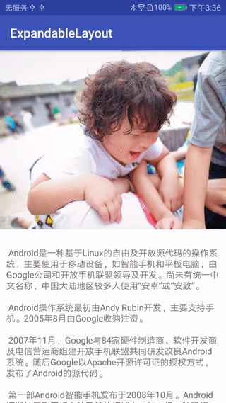

# 可折叠展开的自定义View(Kotlin)

## 效果图



## 使用

### 添加属性

```
    <declare-styleable name="ExpandableLayout">
        <attr name="expandableHeader" format="reference"/> <!-- 头部布局 -->
        <attr name="expandableBody" format="reference"/> <!-- 身体布局 -->
        <attr name="expandableParallax" format="float"/>  <!-- 滚动视察因子，也叫阻尼因子，值越小越难滚 -->
    </declare-styleable>
```

### 在布局中使用 

```

<com.xiaohongshu.demo4copy.ExpandableLayout
    xmlns:android="http://schemas.android.com/apk/res/android"
    xmlns:app="http://schemas.android.com/apk/res-auto"
    android:id="@+id/expandableLayout"
    android:layout_width="match_parent"
    android:layout_height="match_parent"
    app:expandableBody="@layout/expandable_body"
    app:expandableHeader="@layout/expandable_header"
    app:expandableParallax="0.7">

</com.xiaohongshu.demo4copy.ExpandableLayout>
```

完。

关于
--

博客：[http://blog.csdn.net/aishang5wpj](http://blog.csdn.net/aishang5wpj)

邮箱：337487365@qq.com

License
--
Copyright 2017 aishang5wpj

Licensed under the Apache License, Version 2.0 (the "License"); you may not use this file except in compliance with the License. You may obtain a copy of the License at

http://www.apache.org/licenses/LICENSE-2.0

Unless required by applicable law or agreed to in writing, software distributed under the License is distributed on an "AS IS" BASIS, WITHOUT WARRANTIES OR CONDITIONS OF ANY KIND, either express or implied. See the License for the specific language governing permissions and limitations under the License.
